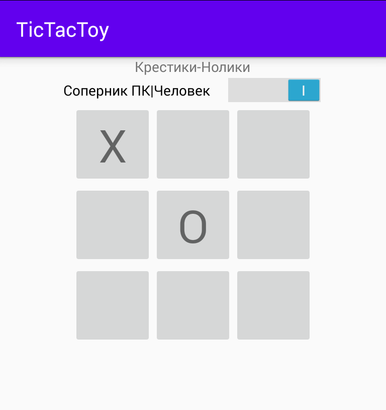

# Игра крестики нолики в рамках курса Job4j по мобильной разработке

## Screen

## Правила игры
### Возможность игры с собой и с AI
Соперники ходят по очереди. AI всегда играет ноликом. Програвший ходит в следующей партии первым. Есть возможность на ходу включать и выключать AI 

### Для возможности победы человека алгоритм работы AI максимально прост и не борется за победу. Мой маленькой дочке такой соперник по душе. ))
 

## Контакты
*my@e-mail.com
[Vk](https://vk.com/)
